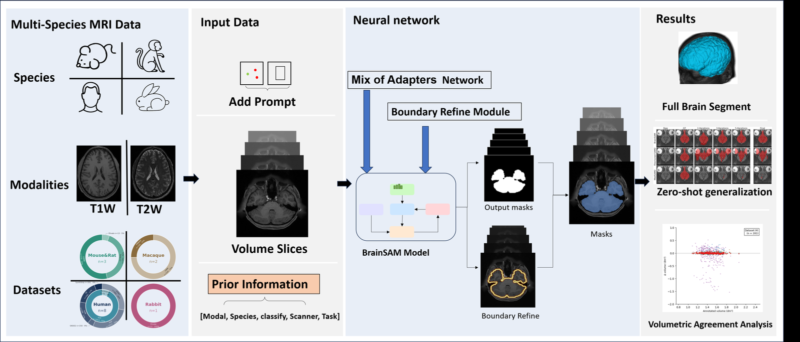
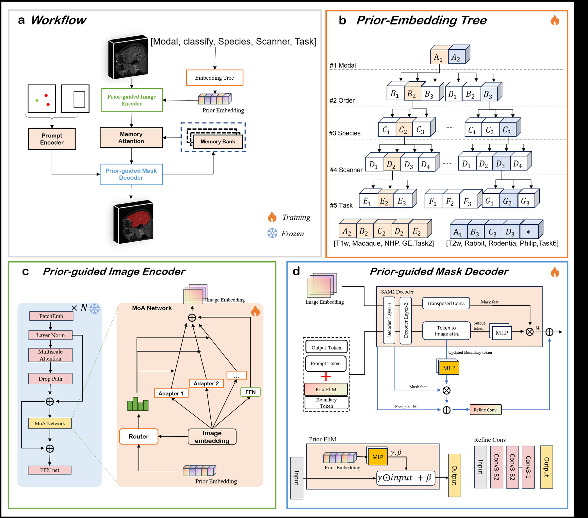

# BrainSAM: A SAM2-based Pipeline for Cross-Species, Cross-Modality Brain Structure Segmentation

# Contents

- [Overview](#overview)
- [BrainSAM Pipeline](#brainsam-pipeline)
- [System Requirements](#system-requirements)
- [Installation](#installation)
- [Getting Started](#getting-started)
- [License](#license)

## ✨ Overview

**BrainSAM** is an open-source, modular pipeline for brain structure segmentation across species and imaging modalities, built on top of [SAM 2](https://github.com/facebookresearch/sam2) (Meta, Apache-2.0). It extends SAM 2's image/video predictors with components specific to brain imaging, and wraps them in both a desktop and a web annotation tool so segmentation masks can be produced, corrected, and exported without writing code.

The pipeline is organized around two complementary concerns:

* **Core segmentation model** — SAM 2's Hiera backbone, mask decoder, and memory modules, extended with brain-specific components:

  * **Embedding Tree:** a modality/organ prior-embedding mechanism that conditions the model on which species and structure it is segmenting.
  * **Mixture-of-Adapters (MoA):** a routed adapter module inserted into the deeper blocks of the Hiera backbone.
  * **Boundary Refinement Module (BRM):** a dedicated boundary-supervision head trained with a morphology-derived boundary ground truth.

* **Annotation and evaluation tooling** — used to get data in, inspect/correct predictions, and score results:

  * **Desktop app (`app.py`):** a PyQt5 tool for loading NIfTI volumes, prompting SAM2 with points/boxes, and propagating masks across slices.
  * **Web app (`BrainLynx_web/`):** a FastAPI re-implementation of the same workflow for browser-based, multi-user access on a shared server.
  * **Evaluation scripts (`evaluate/`):** batch inference plus Dice / Surface Dice / Surface Distance (HD95) scoring against ground-truth masks.

Across training and evaluation, BrainSAM has been used on data spanning **human, monkey, mouse, and rabbit** brains, and multiple MRI contrasts (T1, T2, ...).

<p align="center">
  
</p>
<p align="center"><em>Figure 1. BrainSAM pipeline overview — multi-species, multi-modality MRI input with prior information (modality, species, scanner, task), the BrainSAM model (Mixture-of-Adapters + Boundary Refine Module), and example outputs: full-brain segmentation, zero-shot generalization, and volumetric agreement analysis.</em></p>

## BrainSAM Pipeline

### 1. Data loading

NIfTI volumes are read and sliced along a configurable axis (`utils/nifti_reader.py`), with dataset wrappers in `data/` for training (`data/dataset.py`, `data/sam2_dataset/`, which is adapted from SAM 2's own video-dataset loader) and in `training/dataset/` for the training loop itself.

### 2. Core segmentation model

`sam2/` holds the model code, adapted from Meta's SAM2.1 (`hiera_base_plus` backbone). On top of it, `sam2/modeling/Brainsam_base.py`, `BrainMaskDecoder.py`: the Embedding Tree prior, the MoA adapters, and the boundary-refinement head. Everything else in the model — the neck, memory attention, memory encoder, and the pretrained parts of the mask decoder — is initialized from the official SAM 2.1 checkpoint.

<p align="center">
  
</p>
<p align="center"><em>Figure 2. BrainSAM architecture — (a) overall workflow from prompts and prior tags to the segmented mask; (b) the Prior-Embedding Tree, which encodes [modality, order, species, scanner, task] into a prior embedding; (c) the Prior-guided Image Encoder, where a router feeds image embeddings into a Mixture-of-Adapters (MoA) network on the frozen Hiera trunk; (d) the Prior-guided Mask Decoder, with the Prior-FiLM conditioning block and the boundary-refinement convolution stack.</em></p>

### 3. Training

`training/train.py` is the entry point; it uses Hydra to read YAML configs from `sam2/configs/sam2.1_training/` (default: `sam2.1_hiera_b+BrainSAM.yaml`), which define the loss weights (`training/loss_fns.py`), optimizer/LR schedule (`training/optimizer.py`), and per-species batch composition. Development training runs used 2× NVIDIA A6000 (48GB) GPUs.

### 4. Interactive annotation

The desktop app (`app.py`) and web app (`BrainLynx_web/`) both drive the same underlying predictors — an image predictor for single-frame/PNG prompting and a video predictor for mask propagation across a volume (`Inference/Continuous_Inference.py`). 

### 5. Evaluation

`evaluate/` scripts run a built predictor over a folder of cases and report Dice, Average Surface Distance, and HD95 (`evaluate/metrics/`) against ground-truth masks, optionally resuming from a JSON progress log and writing results to an `.xlsx` workbook.

## System Requirements

BrainSAM has been developed and run on:

- Windows (desktop app, web app)
- Linux (training, batch evaluation)

GPU acceleration (CUDA) is required for training and for GPU-backed inference; the desktop and web apps can also be opened and used in a CPU-only. Development training runs used **2× NVIDIA A6000 (28GB)** GPUs; no formal minimum RAM has been benchmarked, but enough system memory to hold full-volume NIfTI data and dataloader batches is recommended.

## Installation

```bash
git clone <this-repository-url>
cd BrainSAM

conda create -n brainsam python=3.10
conda activate brainsam
pip install -r requirements.txt
# or: pip install -e .   (setup.py declares optional extras: web / gui / train)
```


## 🚀 Getting Started

### Configuration

Training and evaluation are both driven by config files rather than hardcoded paths:

- **`sam2/configs/sam2.1_training/*.yaml`** — training configs (data paths, loss weights, optimizer, schedule). The shipped `sam2.1_hiera_b+BrainSAM.yaml` has placeholder data paths (`/path/to/your/...`) that must be pointed at your own dataset before training; the checkpoint path and `training/assets/*.txt` split lists are already repo-relative.
- **`evaluate/config.py`** — `EXPERIMENTS` / `get_args()` define per-species/modality evaluation runs; also placeholder paths, edit for your own experiments.

### Running the Pipeline

**Desktop app:**

```bash
python app.py
```

The app does **not** auto-load a model or checkpoint at startup. At the bottom of the window, use the "Video:" / "PNG:" row: click the "..." button to pick a checkpoint (the dialog opens in `work_dir/` by default), then click **init_v** / **init_p** to build that predictor. The **Device** label reflects whichever device was actually used the last time a predictor was built (CUDA if available, otherwise CPU).

**Web app:**

```bash
cd BrainLynx_web
pip install -r requirements.txt
python server.py
```

Edit the `CONFIG` block at the top of `server.py` (`PROJECT_ROOT`, `SAM2_CKPT`, `HOST`/`PORT`) for your machine first; see `BrainLynx_web/README.md` for details and known caveats.

**Training:**

```bash
python training/train.py --config sam2.1_training/sam2.1_hiera_b+BrainSAM.yaml
```

**Output structure** (training):

```text
sam2_logs/
└── <config-name>/
    ├── config.yaml              # resolved copy of the config used for this run
    ├── config_resolved.yaml
    └── checkpoints/
        └── checkpoint.pt
```

**Evaluation** :

```bash
python evaluate/evaluate_brainSAM.py
```

**Output structure** (evaluation):

```text
<save_dir>/
├── <case>_mask.nii.gz          # per-case predicted mask
├── checkpoint_<sheet>.json     # resumable progress log
└── results.xlsx                # Dice / ASD / HD95 per case, one sheet per experiment
```


## 📜 License

BrainSAM is derived from Meta's SAM 2 codebase and is licensed under the **Apache License, Version 2.0** — see `LICENSE`. Most files under `sam2/` retain Meta's original copyright header; `NOTICE` summarizes what was changed for BrainSAM and should have the author/affiliation placeholder filled in before publishing.
